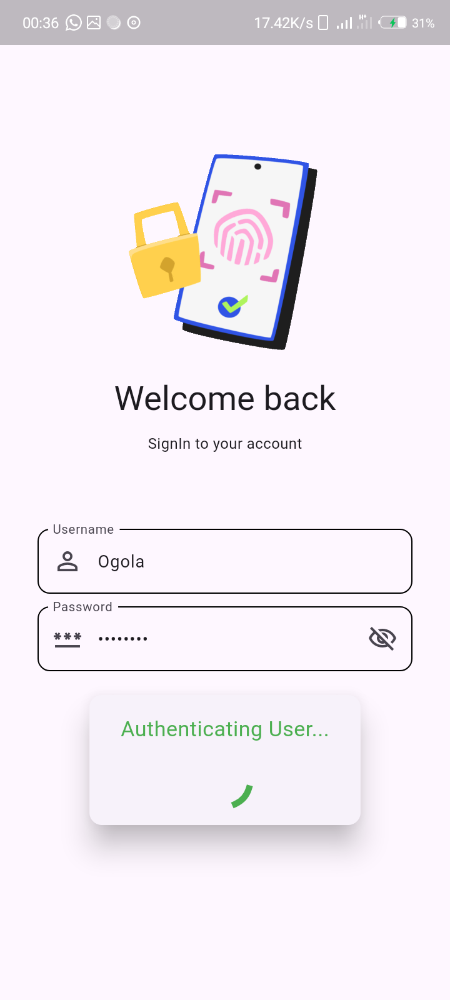
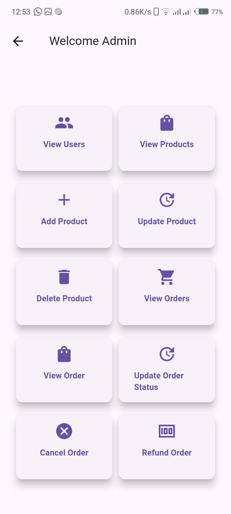
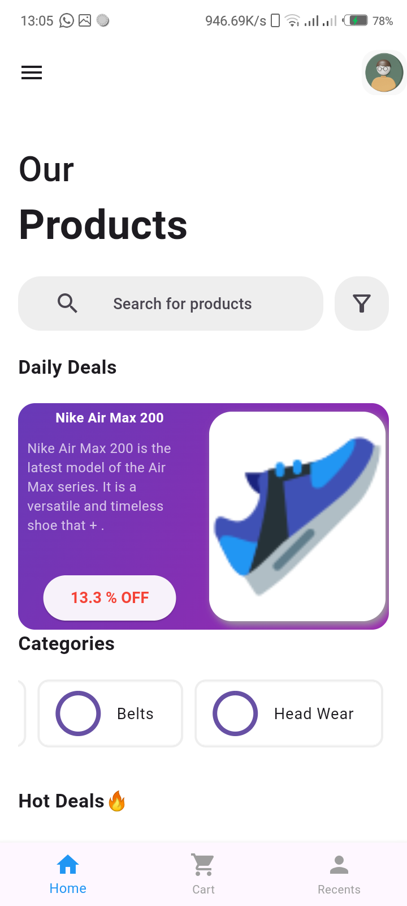
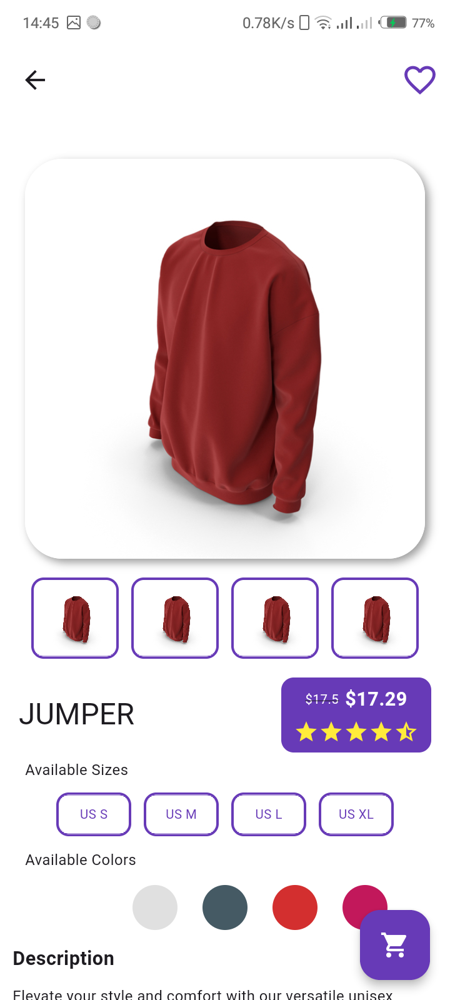
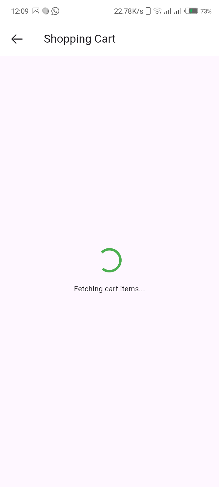

# Smart Shop - Your Personal Shopping Mall😉

Welcome to **Smart Shop**, an all-in-one e-commerce app for clothing. This Flutter-based app provides a seamless shopping experience with a beautiful UI, easy navigation, and secure transactions.

## Features

- **User Authentication**: Sign up, log in, and manage your profile securely.
- **Browse and Search**: Explore categories or search for specific products.
- **Product Details**: View detailed product information, including images, sizes, colors, and prices.
- **Shopping Cart**: Add products to your cart and proceed to checkout.
- **Wishlist**: Save items for later in your wishlist.
- **Discounts and Offers**: Enjoy special discounts, promo codes, and sales events.
- **Order History**: View and track your past orders.
- **Notifications**: Stay updated with push notifications about sales and order status.
- **Dark Mode**: Switch between light and dark themes.

## Installation

### Prerequisites
- Flutter SDK installed
- Dart SDK installed
- Android Studio or Visual Studio Code for IDE

### Future Improvements

- **Payment Integration**: Add payment gateway integration for seamless transactions.
- **Social Login**: Allow users to log in using social accounts like Google and Facebook.
- **Reviews and Ratings**: Enable customers to leave reviews and rate products.

### Contributing
Contributions are welcome! If you have any suggestions or find issues, feel free to open an issue or submit a pull request.

## Fork the project

- Create your feature branch (git checkout -b feature/YourFeature)
- Commit your changes (git commit -m 'Add Your Feature')
- Push to the branch (git push origin feature/YourFeature)
- Open a pull request

## Product Screens

Login Screen

Admin Screen

Home Screen

Product Details

Cart Screen

Payment Screen

<!--    -->
<!--    -->